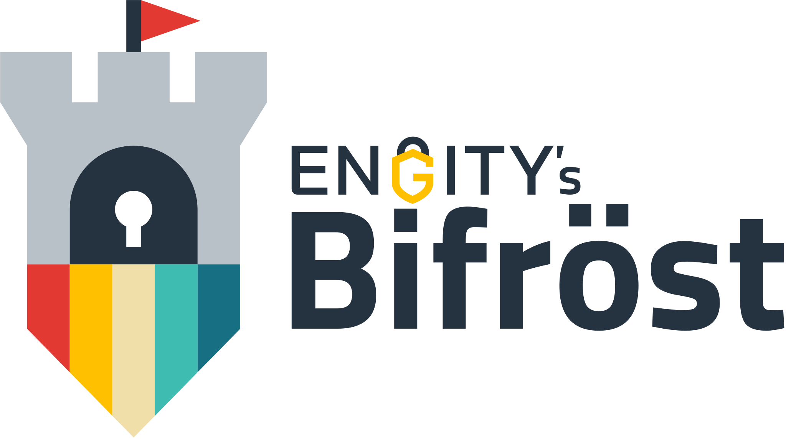

# Engity's Bifröst

Bifröst is a configurable SSH server and gateway for teams managing access to hosts and isolated work environments. Flows combine authorization with where a session runs. Users connect with a standard SSH client; OIDC Device Authorization also requires a browser and a suitable identity provider.

## Features

* **Standard SSH clients:** Connect using OpenSSH, PuTTY or another regular SSH client without installing a Bifröst-specific client.
* **Flexible authorization:** Choose local accounts, SSH keys or [OIDC Device Authorization](docs/guides/oidc.md) through configurable access flows.
* **Host and container sessions:** Work as a local user, in a Docker container or in a Kubernetes Pod; optionally provision and clean up managed local accounts.
* **SSH gateway:** Reach private SSH servers through a [separately authenticated connection](docs/guides/ssh-gateway.md) with target host-key verification.
* **Audit and recording:** Optionally write signed audit events and verifiable [terminal recordings](docs/guides/recording.md).
* **Time-bound access:** Set connection and session lifetimes to support [off-boarding targets](docs/usecases.md#offboard) such as 15 or 60 minutes, and test the result against your requirements.

## Get started

[Install Bifröst on Linux, Windows or macOS](docs/setup/on-host.md) as a host service, or choose a [container installation](https://bifroest.engity.org/setup/in-docker/). Then follow a task guide:

* [OIDC login with a standard SSH client](docs/guides/oidc.md)
* [SSH gateway to an OpenSSH server](docs/guides/ssh-gateway.md)
* [Verifiable session recording](docs/guides/recording.md)

The links to files in this repository describe the current source. For an installation, choose a [published release](https://github.com/engity-com/bifroest/releases) and its **matching versioned documentation** at [bifroest.engity.org](https://bifroest.engity.org/); the site root describes the current stable release, which may differ from `main`. Alpha and beta container images use only full version tags such as `:1.0.0-beta1`; `:latest` and other moving tags are for stable releases.

## OpenSSH migration and security

Replacing an OpenSSH `sshd`? Use the [host installation guide](docs/setup/on-host.md) to set up Bifröst, and the [configuration reference](docs/reference/configuration.md) to select your SSH access policies. Review the [upgrade guidance](docs/setup/upgrade.md) when updating Bifröst and the [security policy](SECURITY.md) for vulnerability reporting.

## Project

[License](LICENSE) | [Contributing](CONTRIBUTING.md) | [Code of Conduct](CODE_OF_CONDUCT.md) | [Report an issue](https://github.com/engity-com/bifroest/issues/new/choose) | [Discussions](https://github.com/engity-com/bifroest/discussions)
