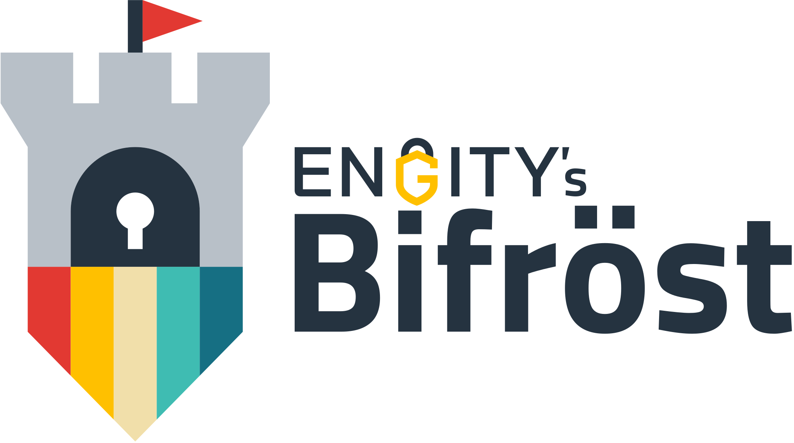

# Engity's Bifröst

Bifröst (spoken as "Bee-frest"), is an advanced SSH server. It can be used as a drop-in-replacement for [OpenSSH Server](https://www.openssh.com/), but it was actually created with some more advanced stuff in mind; see below.

## TOC

* [Use-cases](https://bifroest.engity.org/latest/usecases/)
* [Features](#features)
* [Getting started](https://bifroest.engity.org/latest/setup/)
* [Configuration](https://bifroest.engity.org/latest/reference/configuration/)
* [Status](#status)
* [License](LICENSE)
* [Code of Conduct](CODE_OF_CONDUCT.md)
* [Contributing](CONTRIBUTING.md)
* [Security](SECURITY.md)

## Features

1. [SSH protocol compliant](#ssh-protocol-compliant)
2. [OpenID Connect](#openid-connect)
3. [Docker environments](#docker-environments)
4. [Remember me](#remember-me)
5. [Automatic user provisioning](#automatic-user-provisioning)

#### SSH protocol compliant

Fully **[SSH protocol](https://www.rfc-editor.org/rfc/rfc4253) compliant server**, like you would expect.

#### OpenID Connect
You can connect via your **SSH keys**, as usually. And so on...

...but you can also use **[OpenID Connect](https://openid.net/)** (or OAuth2) identity provider. The best thing about this is: In contrast to the other SSH servers with OpenID Connect, you don't need any other client locally installed, than your regular SSH Client ([OpenSSH](https://www.openssh.com/), [PuTTy](https://www.putty.org/), ...).

#### Docker environments

You can execute your users into individual Docker containers, with custom images, network settings, ...

#### Remember me

If authorized via another authentication token then a Public Key, it can store (temporally) your provided Public Key, for faster reconnect, while the session is still alive.

#### Automatic user provisioning

If a local environment is used where the user executes inside and [OpenID Connect](#openid-connect) was used to authorize a user, Bifröst can automatically create these users based on a defined requirement template.

It can also automatically clean up these users as they're no longer needed, for example: If their session becoming idle and times out (30 minutes). In this case the user itself, its home directory and all running processes can be cleaned up.

#### More to come...

## What's next?

Read [Use-Cases](https://bifroest.engity.org/latest/usecases/), our [Getting starting guide](https://bifroest.engity.org/latest/setup/) and [the configuration documentation](https://bifroest.engity.org/latest/reference/configuration/) to see what else you can do with Bifröst.

## Status

This project is currently under development. The application is stable ([file a bug if you find one](https://github.com/engity-com/bifroest/issues/new/choose)), but the configuration/command/API structure needs improvement.

## More topics
* [Use-Cases](https://bifroest.engity.org/latest/usecases/)
* [Getting started](https://bifroest.engity.org/latest/setup/)
* [Configuration](https://bifroest.engity.org/latest/reference/configuration/)
* [License](LICENSE)
* [Code of Conduct](CODE_OF_CONDUCT.md)
* [Contributing](CONTRIBUTING.md)
* [Security](SECURITY.md)
